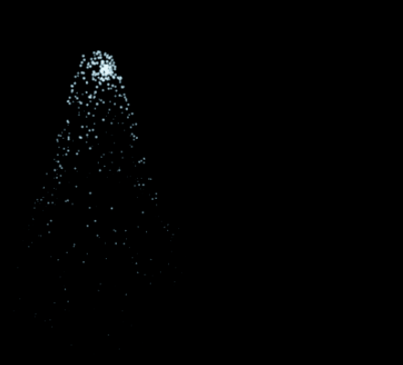

Bindings & samples for Pixi.js related libraries including:
- Pixi.js
- [Pixi-particles](https://github.com/pixijs/pixi-particles)
- [Pixi-Sound](https://github.com/pixijs/pixi-sound)
- [Animejs tweening library](http://animejs.com/)

### Pixi-particles


[Pixi-particles](https://github.com/pixijs/pixi-particles)'s really easy to use and there's a great [online editor](https://github.com/pixijs/pixi-particles) to configure your particle effects easily

>Go to the `src/particles` folder to have a go. And make changes to the json located under `public/img/emitter.json` to see what you can do with particles.

### Pixi-Sound
We also support [Pixi-Sound](https://github.com/pixijs/pixi-sound), the official pixi sound API.

> Go to the `src/sound` folder to see a sample in action.


### Animatejs Tweening



We support [Animejs](http://animejs.com/) for all your tweenings!

> Go to the `src/animejs` folder to see a sample in action.


# How to build and add your samples

## Building and running the samples

- Restore NPM dependencies: `yarn install`
- Restore NuGet dependencies: `dotnet restore`
- **Move to src folder**: `cd src`
- Start Fable and Webpack dev server: `dotnet fable yarn-start`
- In your browser, open `localhost:8080/[EXAMPLE]` (e.g. `http://localhost:8080/ozmo`)

Any modification you do to the F# code will be reflected in the web page after saving.
If you want to write JS files to disk instead of using the development server,
run `dotnet fable yarn-build`.

## Adding a new sample

- Take one of the existing samples as a reference.
- Add the information about your sample to `public/samples.json5`: id, entry file (usually the .fsproj), title and description; in one of the three categories: "games", "visual" or "productivity".
- Add one folder named after the id of the sample to `src` directory and another one to `public`. The first one will contain the F# (and maybe JS) source files, while the second contains the public assets for the sample (like index.html, images, etc).
- Add the project to the `Fable.Samples.sln` solution: `dotnet sln add src/my-sample/My.Sample.fsproj`
- Restore NuGet dependencies: `dotnet restore`

## Webpack configuration

Pixi requires to set additional externals to work with webpack. Like this:

```json
  externals: {
    "PIXI": "PIXI",
    "PIXI.extras": "PIXI.extras",
    "PIXI.loaders": "PIXI.loaders",
    "PIXI.settings": "PIXI.settings",
    "PIXI.mesh": "PIXI.mesh",
    "PIXI.particles":"PIXI.particles"
  },
```

Would you stumble on errors like this: `Module not found: Error: Can't resolve 'PIXI.xxx' in ...`,  just add the module to the Webpack config.
